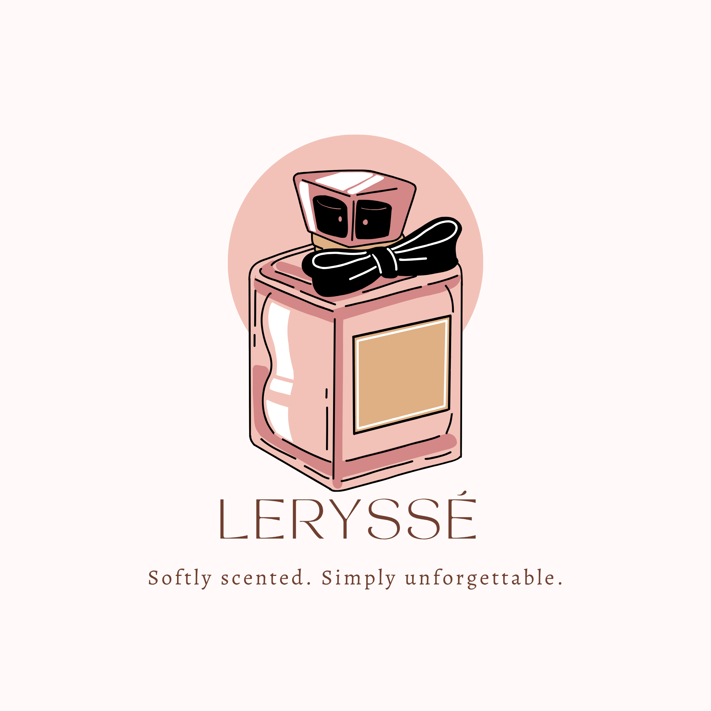
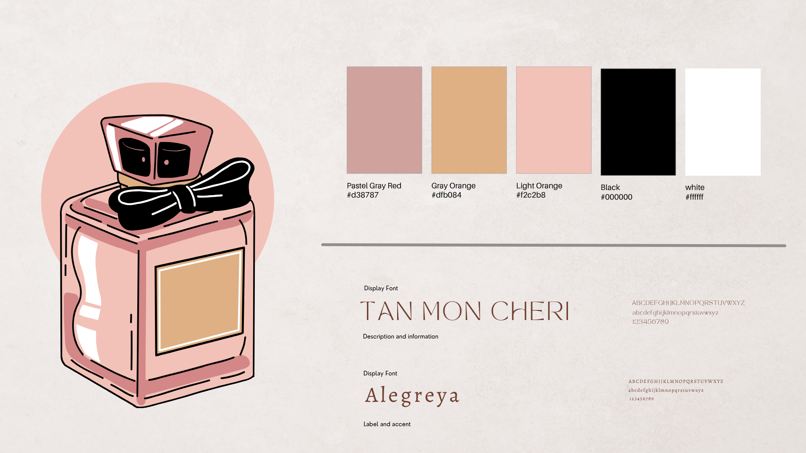

 

# ୨୧ ♡ ୨୧
# **ACTIVITY 02**
# **COLOR PALETTE & TYPOGRAPHY**

### 🎀 `COLOR` • 🌷 `TYPE` • 🦢 `VISUAL IDENTITY`

 

**˚₊‧꒰ა ♡ ໒꒱ ‧₊˚**

### 🌸 *Creating a visual identity through color,*  
### *typography, and meaningful design choices.* 🎨

**˚₊‧꒰ა ♡ ໒꒱ ‧₊˚**

 

---

# 🎀 𝓜𝔂 𝓥𝓲𝓼𝓾𝓪𝓵 𝓘𝓭𝓮𝓷𝓽𝓲𝓽𝔂 🎀

 

For Activity 2, I developed a personal visual identity by creating a **personal logo, tagline, color palette, and typography system**.

The goal was to create a design that reflects a soft, elegant, feminine, and memorable aesthetic while maintaining consistency across different visual elements.

 

**୨୧ ─────────────── ୨୧**

# 🌸 𝓟𝓮𝓻𝓼𝓸𝓷𝓪𝓵 𝓛𝓸𝓰𝓸 🌸

 

 

### 🎀 **LERYSSE**

### *Personal Logo*

 

The logo combines a **stylized fragrance bottle, a bow, and a soft pink color scheme** to create a feminine and elegant visual identity.

The fragrance bottle represents **beauty, identity, and individuality**, while the bow adds a delicate and playful element to the design.

The circular pink background creates emphasis around the illustration and helps separate the logo from the surrounding space.

 

### ✦ Why I chose this design:

🌷 **Soft and feminine** — reflects elegance and delicacy  
🎀 **Memorable symbol** — the bow and perfume bottle create a recognizable identity  
🪞 **Simple composition** — keeps the logo visually clean  
💗 **Personal expression** — represents a style that feels personal and meaningful

 

**୨୧ ─────────────── ୨୧**

# 💌 𝓣𝓪𝓰𝓵𝓲𝓷𝓮 💌

 

 

### **“Softly scented. Simply unforgettable.”**

 

The tagline was created to complement the fragrance-inspired identity of the logo.

The phrase **“Softly scented”** communicates gentleness and elegance, while **“Simply unforgettable”** emphasizes the idea of creating a lasting impression.

The tagline uses a sophisticated and minimal presentation so that it supports the logo without competing with it.

 

### 🌸 **Purpose of the tagline**

| 🎀 Element | ✦ Meaning |
|:---|:---|
| **Softly scented** | Represents gentleness, elegance, and subtle beauty |
| **Simply unforgettable** | Represents individuality and lasting impression |
| **Minimal wording** | Makes the message easy to remember |
| **Elegant typography** | Reinforces the sophisticated brand identity |

 

**˚₊‧꒰ა 🌷 ໒꒱ ‧₊˚**

# 🎨 𝓒𝓸𝓵𝓸𝓻 𝓟𝓪𝓵𝓮𝓽𝓽𝓮 & 𝓣𝔂𝓹𝓸𝓰𝓻𝓪𝓹𝓱𝔂

 

 

### 🌹 *My chosen visual system*

 

# 🎀 𝓒𝓸𝓵𝓸𝓻 𝓟𝓪𝓵𝓮𝓽𝓽𝓮

 

The color palette consists of **soft and warm neutral tones** that complement the feminine fragrance concept.

 

| 🎨 Color | Hex Code | Purpose |
|:---:|:---:|:---|
| 🌷 **Pastel Gray Red** | `#D38787` | Adds a soft dusty-rose tone and visual warmth |
| 🧸 **Gray Orange** | `#DFB084` | Adds warmth and connects with the fragrance aesthetic |
| 🌸 **Light Orange** | `#F2C2B8` | Creates a gentle and feminine atmosphere |
| 🖤 **Black** | `#000000` | Provides strong contrast and definition |
| 🤍 **White** | `#FFFFFF` | Creates clarity, balance, and visual breathing room |

 

### ✦ **Why I selected these colors**

The palette was chosen to create a feeling of **softness, warmth, elegance, and sophistication**.

The pink and peach tones create the primary mood of the identity, while black provides contrast and definition. White balances the warmer colors and prevents the design from appearing too heavy.

Together, the colors create a cohesive visual identity that is both **delicate and distinctive**.

 

**୨୧ ─────────────── ୨୧**

# 🔤 𝓣𝔂𝓹𝓸𝓰𝓻𝓪𝓹𝓱𝔂

 

### 🌹 **TAN MON CHERI**

**Display Font**

 

The **Tan Mon Cheri** typeface was selected as the main display font because of its elegant and sophisticated appearance.

Its thin, refined letterforms give the brand a **luxurious and feminine character**, making it appropriate for the logo and major visual elements.

 

### 🌷 **Alegreya**

**Supporting Font**

 

**Alegreya** was selected as the supporting typeface because it provides a readable yet elegant appearance.

It complements the decorative quality of Tan Mon Cheri while remaining suitable for descriptions and supporting information.

 

### ✦ **Typography Combination**

**TAN MON CHERI**  
→ Elegant • Decorative • Feminine • Attention-grabbing

**Alegreya**  
→ Readable • Classic • Refined • Supportive

 

Using two complementary typefaces creates **contrast and hierarchy** without making the visual identity feel inconsistent.

 

**୨୧ ─────────────── ୨୧**

# 🪞 𝓥𝓲𝓼𝓾𝓪𝓵 𝓒𝓸𝓷𝓼𝓲𝓼𝓽𝓮𝓷𝓬𝔂 🪞

 

The logo, tagline, color palette, and typography were designed to work together as one visual identity.

 

### 🎀 **LOGO**
Creates recognition and represents the brand.

### 🌷 **COLOR**
Establishes the mood and emotional identity.

### 🦢 **TYPOGRAPHY**
Creates hierarchy and communicates personality.

### 💌 **TAGLINE**
Strengthens the message and makes the identity memorable.

 

These elements work together to create a visual system that feels **cohesive, elegant, and intentional**.

 

**˚₊‧꒰ა ♡ ໒꒱ ‧₊˚**

# 🌸 𝓗𝓸𝔀 𝓣𝓱𝓮 𝓒𝓱𝓸𝓲𝓬𝓮𝓼 𝓘𝓶𝓹𝓻𝓸𝓿𝓮𝓭 𝓜𝔂 𝓓𝓮𝓼𝓲𝓰𝓷

 

My choices improved the overall design by giving each element a clear role.

**🎨 Color** created a consistent emotional tone and connected the different outputs.

**🔤 Typography** established hierarchy while adding elegance and personality.

**🎀 Logo design** provided a recognizable visual symbol.

**💌 Tagline** strengthened the identity by communicating a memorable message.

Together, these choices transformed separate design elements into a **unified personal visual identity**.

 

**୨୧ ─────────────── ୨୧**

# 🩰 𝓜𝔂 𝓡𝓮𝓯𝓵𝓮𝓬𝓽𝓲𝓸𝓷

 

> 🌸 *“A strong visual identity is created when every element tells the same story.”*

This activity helped me understand that choosing colors and fonts is not simply about selecting what looks attractive. Each choice contributes to how a design is perceived and remembered.

I learned that a successful visual identity requires **consistency, contrast, balance, and purpose**.

Creating my personal logo, tagline, color palette, and typography helped me discover how visual elements can express personality and create a recognizable identity.

Through this activity, I became more intentional about choosing colors and typefaces that complement each other and communicate the mood I want my designs to convey.

 

**˚₊‧꒰ა ♡ ໒꒱ ‧₊˚**

# 💋 **COLOR CREATES MOOD.**
# 🎀 **TYPE CREATES PERSONALITY.**
# 🌷 **DESIGN CREATES IDENTITY.**

 

**𓆩♡𓆪 ─────────────── 𓆩♡𓆪**

### 🥀 **ACTIVITY 02 COMPLETE** 🥀

**𓆩♡𓆪 ─────────────── 𓆩♡𓆪**

 

