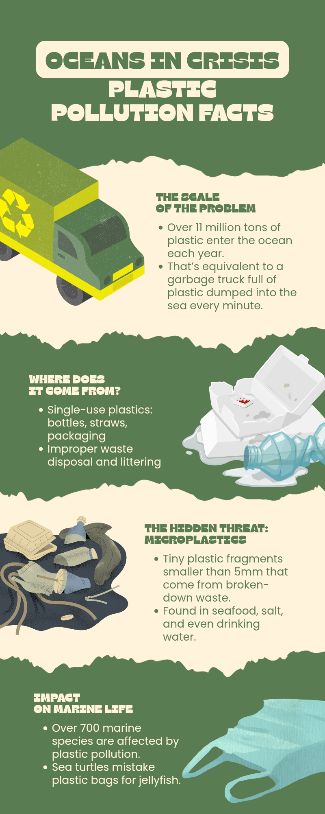

 

# ୨୧ ♡ ୨୧
# **ACTIVITY 03**
# **SOCIAL MEDIA INFOGRAPHICS**
# **& MINI PROJECT**

### 🌿 `INFORM` • 🎨 `DESIGN` • ♻️ `CREATE`

 

**˚₊‧꒰ა ♡ ໒꒱ ‧₊˚**

### 🌱 *Turning information into visual stories*  
### *that educate, engage, and inspire action.*

**˚₊‧꒰ა ♡ ໒꒱ ‧₊˚**

 

---

# 🌿 𝓐𝓬𝓽𝓲𝓿𝓲𝓽𝔂 03 𝓞𝓾𝓽𝓹𝓾𝓽 🌿

 

## ♻️ **CLEANSEAS IN CRISIS**
## **PLASTIC POLLUTION FACTS**

 

 

### 🌱 *Social Media Infographic*

 

**୨୧ ─────────────── ୨୧**

# 🌷 𝓣𝓱𝓮 𝓒𝓸𝓷𝓬𝓮𝓹𝓽 🌷

 

The concept of this infographic is to raise awareness about **plastic pollution in the oceans** by presenting important facts in a simple and visually engaging format.

Instead of presenting the information as a long block of text, the infographic divides the topic into several sections that are easy to scan and understand.

The infographic highlights:

🌊 **The scale of plastic pollution**  
🗑️ **Where plastic waste comes from**  
🔬 **The problem of microplastics**  
🐢 **The impact on marine life**

 

The goal is to make an environmental issue feel **accessible, understandable, and visually memorable**.

 

**୨୧ ─────────────── ୨୧**

# 🎨 𝓓𝓮𝓼𝓲𝓰𝓷 𝓒𝓱𝓸𝓲𝓬𝓮𝓼 🎨

 

## 🌿 **01 — COLOR**

The infographic uses a combination of **dark green, light cream, yellow, and muted blue-green tones**.

The green palette connects the design to **nature and the environment**, while the cream sections provide contrast and improve readability.

### ✦ Effect:

The colors establish an environmental theme while creating enough contrast between different sections of information.

 

---

## 🌊 **02 — VISUAL HIERARCHY**

The title **“CLEANSEAS IN CRISIS”** is the first element that attracts attention.

The information is then organized into major sections such as:

**THE SCALE OF THE PROBLEM**  
↓  
**WHERE DOES IT COME FROM?**  
↓  
**THE HIDDEN THREAT: MICROPLASTICS**  
↓  
**IMPACT ON MARINE LIFE**

### ✦ Effect:

This hierarchy guides the audience through the infographic in a logical sequence.

 

---

## ♻️ **03 — IMAGERY**

Illustrations of a recycling truck, plastic waste, microplastics, and marine-related pollution are used to support the information.

### ✦ Effect:

The illustrations make abstract environmental information more concrete and help viewers understand the topic without depending entirely on text.

 

---

## 🪞 **04 — BALANCE & COMPOSITION**

The infographic alternates between **green and cream sections**, while illustrations and text are positioned on opposite sides in several sections.

### ✦ Effect:

This creates visual variety and prevents the long vertical infographic from feeling repetitive or overcrowded.

 

---

## 💌 **05 — PROXIMITY**

Related text and illustrations are grouped together.

For example, the information about the **scale of plastic pollution** is placed beside the recycling truck illustration.

### ✦ Effect:

This allows the audience to connect the visual with the information it represents.

 

---

## ✨ **06 — CONSISTENCY**

The same color palette, typography style, illustration style, and section structure are repeated throughout the infographic.

### ✦ Effect:

Consistency makes the infographic feel like one complete visual story rather than several unrelated pieces.

 

**୨୧ ─────────────── ୨୧**

# 🌱 𝓒𝓻𝓮𝓪𝓽𝓲𝓿𝓮 𝓟𝓻𝓸𝓬𝓮𝓼𝓼 🌱

 

### 💡 **01 — IDEA**

I began with the goal of communicating the seriousness of **plastic pollution** in a way that would be easy for a social media audience to understand.

↓

### 🔎 **02 — ORGANIZE**

I divided the topic into key ideas, including the scale of the problem, sources of plastic waste, microplastics, and effects on marine life.

↓

### 🎨 **03 — DESIGN**

I selected an environmental color palette and combined illustrations with short sections of information to create a visually engaging infographic.

↓

### 🖇️ **04 — ARRANGE**

The text, illustrations, colors, and shapes were arranged to create hierarchy, balance, and a clear visual flow.

↓

### ✨ **05 — REFINE**

I reviewed the overall composition and adjusted the placement of visual elements to keep the infographic readable and engaging.

 

**୨୧ ─────────────── ୨୧**

# ♻️ 𝓜𝓲𝓷𝓲 𝓟𝓻𝓸𝓳𝓮𝓬𝓽 𝓓𝓸𝓬𝓾𝓶𝓮𝓷𝓽𝓪𝓽𝓲𝓸𝓷 ♻️

 

## 🌿 **SMART WASTE MANAGEMENT SYSTEM**

### *For Reducing Plastic Pollution*

 

The mini project proposes a **Smart Waste Management System** that combines technology and community participation to address plastic pollution.

The proposed system uses **smart waste bins, mobile technology, and a digital monitoring platform** to improve how waste is collected, managed, and recycled. :contentReference[oaicite:1]{index=1}

 

### 💡 **HOW THE SYSTEM WORKS**

**01** — Smart bins monitor waste levels using sensors.

**02** — Waste information is sent to a centralized digital platform.

**03** — Waste collectors receive notifications when bins need collection.

**04** — Residents use a mobile application to locate recycling facilities and learn proper waste segregation.

**05** — Reward points encourage recycling and responsible waste disposal. :contentReference[oaicite:2]{index=2}

 

### 🌱 **EXPECTED BENEFITS**

The proposed system aims to:

♻️ Reduce overflowing garbage bins  
🚛 Improve waste-collection efficiency  
🌿 Encourage recycling  
📚 Increase public awareness  
📊 Help identify areas with high amounts of waste  
🏙️ Support better waste-management planning :contentReference[oaicite:3]{index=3}

 

**୨୧ ─────────────── ୨୧**

# 🦢 𝓒𝓸𝓷𝓷𝓮𝓬𝓽𝓲𝓷𝓰 𝓣𝓱𝓮 𝓘𝓷𝓯𝓸𝓰𝓻𝓪𝓹𝓱𝓲𝓬 & 𝓜𝓲𝓷𝓲 𝓟𝓻𝓸𝓳𝓮𝓬𝓽 🦢

 

The infographic focuses on **creating awareness**, while the mini project focuses on **proposing a technology-based solution**.

### 🌊 **INFOGRAPHIC**

**Problem → Awareness → Understanding**

The infographic communicates the seriousness of plastic pollution and its effects on the environment.

### ♻️ **MINI PROJECT**

**Problem → Technology → Solution**

The Smart Waste Management System proposes a practical approach that uses technology and community participation to improve waste management. :contentReference[oaicite:4]{index=4}

 

Together, they demonstrate how **visual communication can introduce a problem while technology and creative thinking can help propose solutions.**

 

**୨୧ ─────────────── ୨୧**

# 🌸 𝓦𝓱𝔂 𝓣𝓱𝓲𝓼 𝓓𝓮𝓼𝓲𝓰𝓷 𝓦𝓸𝓻𝓴𝓼 🌸

 

The infographic was designed specifically to make information **quick to understand and visually memorable**.

### 🎨 **Visuals**
make the topic more engaging.

### 🌿 **Colors**
create an environmental mood.

### 🔤 **Typography**
creates clear information hierarchy.

### 📐 **Layout**
organizes the information into manageable sections.

### ♻️ **Content**
provides facts that support environmental awareness.

 

These choices allow the infographic to communicate its message without overwhelming the audience with large amounts of text.

 

**˚₊‧꒰ა ♡ ໒꒱ ‧₊˚**

# 🪞 𝓜𝔂 𝓡𝓮𝓯𝓵𝓮𝓬𝓽𝓲𝓸𝓷

 

> 🌱 *“Information becomes more powerful when people can see, understand, and connect with it.”*

This activity helped me understand how **visual communication can turn complex information into content that is easier to understand and remember**.

Creating the infographic taught me how important it is to balance information with visual elements. I learned that color, typography, illustrations, hierarchy, and spacing all contribute to how an audience receives a message.

The mini project also allowed me to extend the environmental issue beyond awareness by thinking about a possible technology-based solution. The proposed Smart Waste Management System combines sensors, mobile applications, digital monitoring, and community participation to encourage more responsible waste management. :contentReference[oaicite:5]{index=5}

Overall, this activity strengthened my understanding that **good design is not only about making information attractive—it is about making information meaningful and actionable.**

 

**˚₊‧꒰ა ♡ ໒꒱ ‧₊˚**

# 🌿 **INFORM.**
# ♻️ **INSPIRE.**
# 🌎 **CREATE CHANGE.**

 

**𓆩♡𓆪 ─────────────── 𓆩♡𓆪**

### 🥀 **ACTIVITY 03 COMPLETE** 🥀

**𓆩♡𓆪 ─────────────── 𓆩♡𓆪**

 

### 📄 **MINI PROJECT DOCUMENTATION**

[View Project Documentation](./Project%20Documentation_Ferrer.pdf)

 

